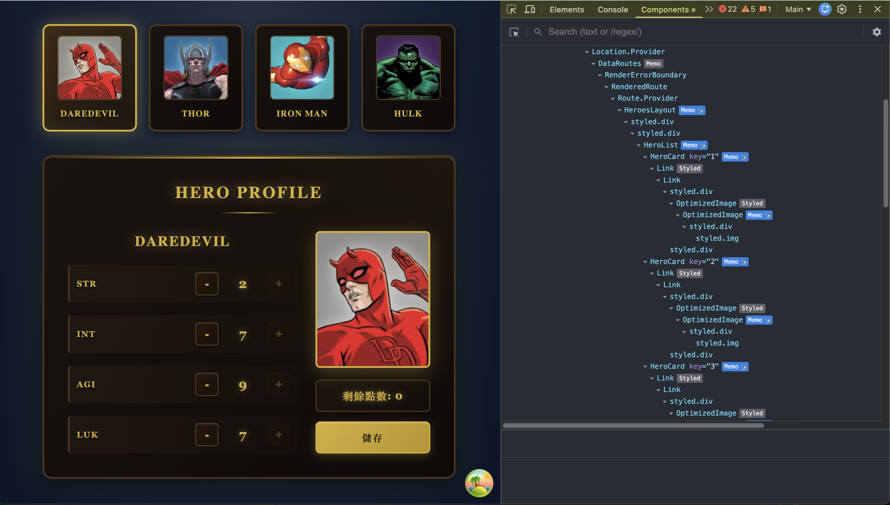
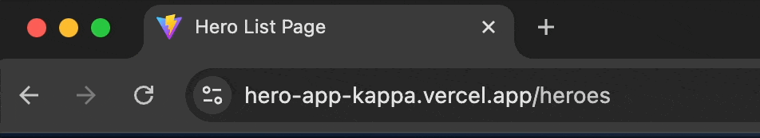
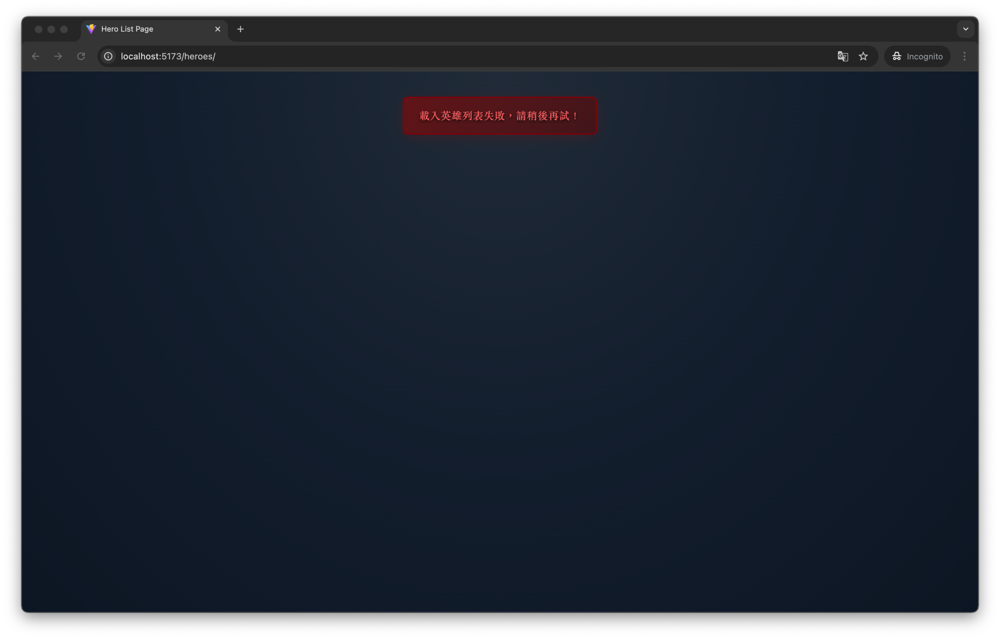
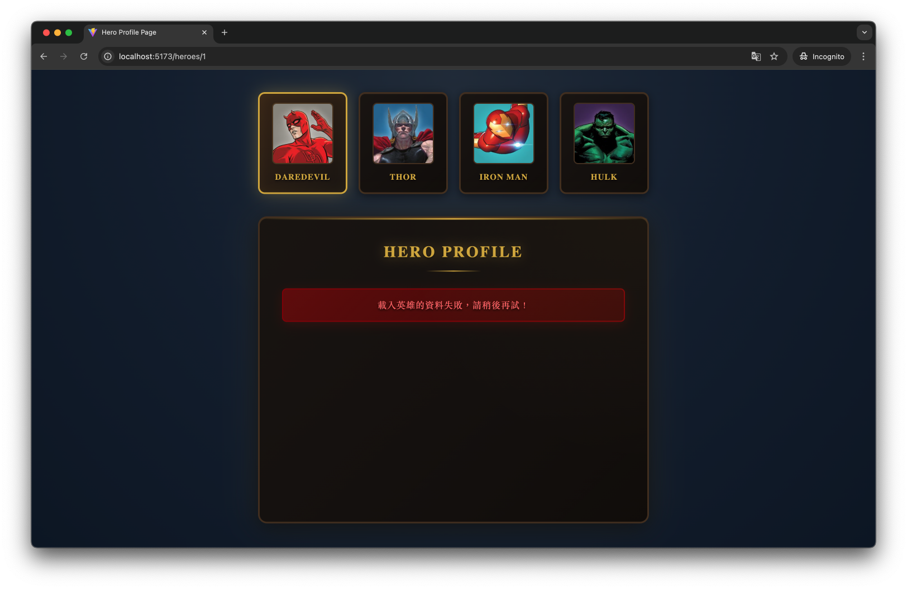
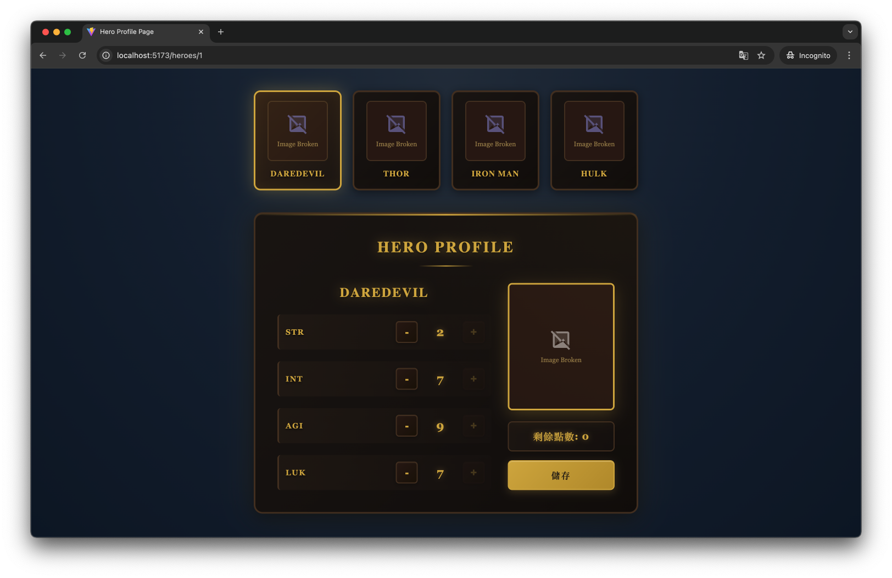
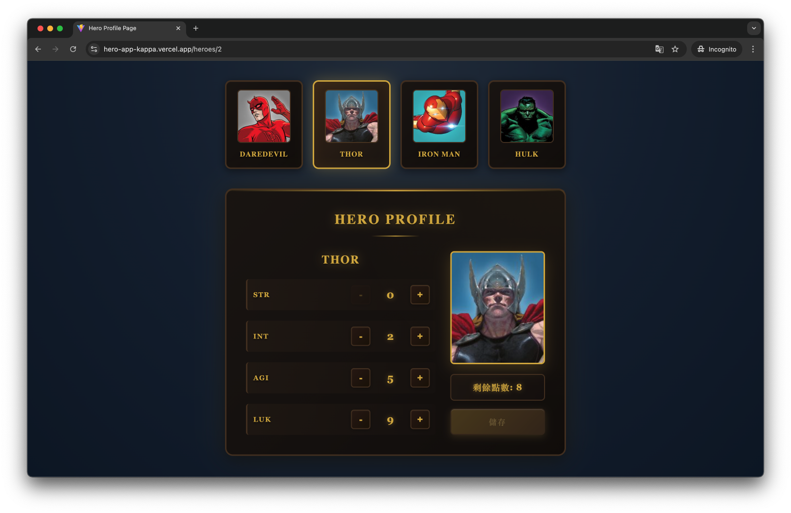
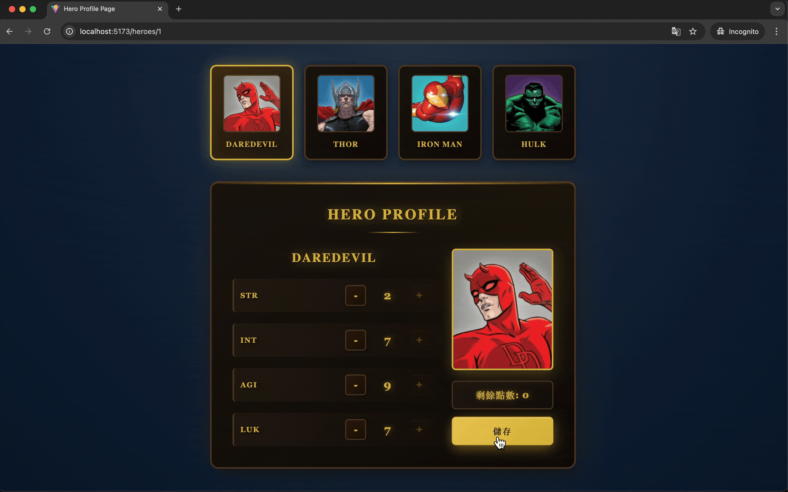
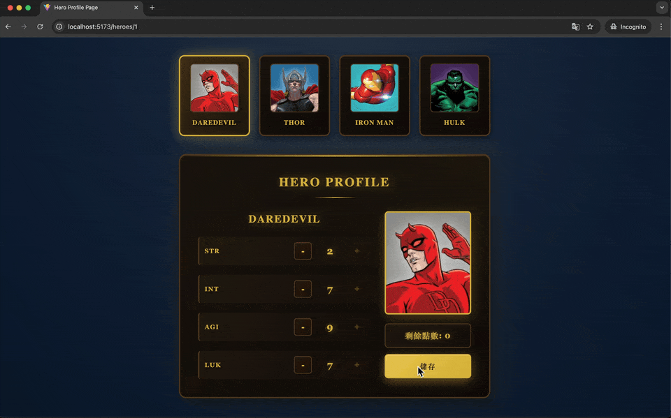
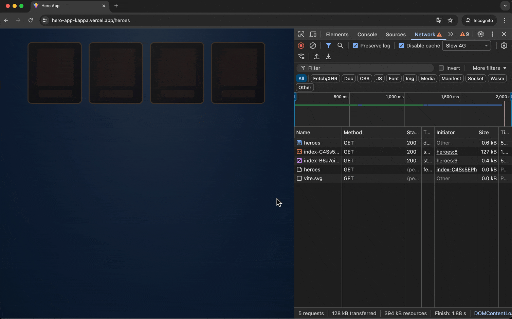
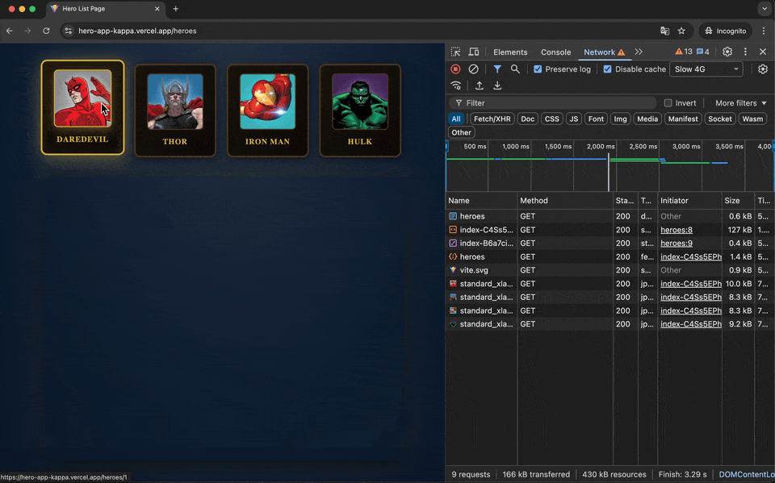

# Hero App

[💻 Demo](https://hero-app-kappa.vercel.app/heroes)

## 如何執行

使用 npm 進行套件管理。

1.  **安裝依賴套件**

    ```bash
    npm install
    ```

2.  **執行專案**

    ```bash
    npm run dev
    ```

    預設會開啟在 `http://localhost:5173`。

3.  **打包專案**

    ```bash
    npm run build
    ```

## 專案架構與設計

使用 **React** 與 **TypeScript** 開發，採用 **Vite** 作為建置工具，並透過 **babel-plugin-react-compiler** 來減少不必要的 re-render，自動進行 memo。


_使用 React Compiler 可以在 React devtools 中看到 `Memo✨` 的標示_

以下為專案的主要架構與設計理念：

### 資料夾結構

```
src/
├── assets/          # 靜態資源
├── components/      # 共用 UI 元件 (HeroCard, HeroList, HeroProfile 等)
├── constant/        # 常數定義
├── hooks/           # Custom Hooks (封裝 API 抓資料邏輯)
├── pages/           # 頁面元件 (HeroListPage, HeroProfilePage)
├── services/        # API 請求服務
├── types/           # TypeScript 型別定義
├── routes.tsx       # 路由設定
├── theme.ts         # Styled-components 主題設定
└── main.tsx         # 專案入口
```

### 邏輯架構設計

1.  **UI 與邏輯分離**：
    - `components/` 資料夾中的元件主要負責 UI 畫面的顯示。
    - API 邏輯被封裝在 `hooks/` (如 `useHeroes`, `useHeroProfile`) 中，讓 UI 元件更乾淨，且邏輯更容易被測試與共用。

2.  **Server State Management**：
    - 使用 **TanStack Query** 來管理 API 的請求狀態。
    - 利用其快取機制，當資料未過期時，不會重複發送請求，減少不必要的 API 請求。
    - 透過其提供的 isLoading、error 等狀態來管理畫面上的 Loading 與錯誤顯示。

3.  **樣式管理**：
    - 使用 **Styled-components** 進行樣式開發。
    - 透過 `theme.ts` 定義全域的顏色變數，方便進行樣式維護與修改。

4.  **路由結構**：
    - 使用 `react-router-dom` 的 Nested Routes 結構，讓專案路由更加清晰易懂。
    - 為符合專案需求將 `HeroList` 放在父層路由 `HeroesLayout` 中，切換子路由時只會異動 `<Outlet />` 裡的內容，確保列表不會重新 render。

### 關於 API 的使用

在實作過程中，我注意到需求文件中提供了 Single Hero [GET] `https://hahow-recruit.herokuapp.com/heroes/:heroId` 的 API。不過經過評估後並沒有使用該 API，原因如下：

- `GET /heroes` (List Heroes) 的 response 中已經包含了所有英雄的 `id`, `name`, 和 `image`，並不需要單獨對某一個英雄進行資料取得。
- 由於需求上英雄列表是固定顯示在上面，當使用者進入 Profile 頁面時，已經擁有該英雄的基本資料 (來自列表)。直接使用列表中的資料可以減少一次 HTTP 請求。
- 不過若未來 Hero List 的資料越來越多，可能造成 `GET /heroes` (List Heroes) 回應速度變慢，就會需要考慮是否使用 `GET /heroes/:heroId` 來讓使用者更快看到單一英雄的 profile 資料。

因此，本專案僅使用了以下 API：

1.  `GET /heroes`
2.  `GET /heroes/:heroId/profile`
3.  `PATCH /heroes/:heroId/profile`

## 第三方 Library 使用說明

| Library                 | 用途         | 選擇原因                                                                                                                                                     |
| :---------------------- | :----------- | :----------------------------------------------------------------------------------------------------------------------------------------------------------- |
| **React Router**        | 路由管理     | 若未使用 Next.js、Remix 等 Meta Framework，此為 React 優先選擇的路由管理套件，v6 後出現的 `<Outlet/>` 寫法可以方便的做到 Hero List 切換子路由不重新 render。 |
| **TanStack Query**      | API 狀態管理 | 簡化了 API 請求的 Loading、Error、Caching 處理，在使用上可以更方便的管理 API 狀態                                                                            |
| **Styled-components**   | CSS-in-JS    | (加分項目) 讓 CSS 寫在 JS 中，除了解決 Class 名稱衝突問題，還能方便地根據 Props 動態調整樣式。                                                               |
| **React Toastify**      | 通知提示     | 輕量的 Toast 套件，用於在儲存成功或失敗時給予使用者回饋。                                                                                                    |
| **ESLint / Prettier**   | 程式碼品質   | 確保 Coding Style 一致，且符合現行最佳實踐規範。                                                                                                             |
| **Husky & Lint-staged** | Git Hooks    | 在 commit 前針對當次異動檔案進行 eslint / prettier 的檢查，確保在不同開發環境下程式碼風格一致。                                                              |

## 功能 Highlights

### 1. Document Title 動態設定

注意到 Wireframe 的圖片中，不同的頁面有不同的 title 設定，因此我選擇使用 React 19 支援的 metadata `<title>` tag 來動態更新 document title：

- `/heroes`: Hero List Page
- `/heroes/:heroId`: Hero Profile Page



### 2. Edge Case 處理

針對各種 edge case 情況進行了完善的處理：

- **API 請求失敗**：使用 TanStack Query 的 error 狀態，顯示錯誤訊息給使用者
  - getHeroes 失敗
    
  - getHeroProfile 失敗
    

- **圖片載入失敗**：提供 fallback 圖片，避免顯示破圖
  
- **能力值邊界檢查**：當還有剩餘點數時，disable 儲存按鈕，並在能力值等於 0 時 disable 減少按鈕
  

### 3. Toast 通知系統

使用 React Toastify 實作通知：

- **儲存成功**

  

- **儲存失敗**

  

### 4. Loading 狀態優化

為了提升使用者體驗，實作了不同的 Skeleton Loading，只針對需要 API 載入的區塊顯示 Loading 狀態：

- **Hero List Page**

  

- **Hero Profile Page**：

  

## 註解原則

我認為程式碼本身應該就是最好的文件，所以我會盡量透過可讀性高的變數命名、函式命名來表達程式邏輯。並透過單一職責原則，讓每個函式或元件更加單純，這樣可以讓程式碼更容易理解與維護。

而我會寫註解的情況如下：

1.  商業邏輯複雜或無法一眼就看懂時。
2.  產業特有的名稱或定義，加上註解可以讓後續的開發人員能更快理解其用途及意義。
3.  因為某些技術限制或特殊情況必須使用非標準的寫法時。例如因為使用套件導致 UI 顯示問題，常看到使用 `setTimeout` 來解決，就需要額外加上註解說明。

## 遇到的困難與解決方法

### 1. 畫面上 Loading 的狀態處理

**困難**：一開始在切換 Profile 時，是讓整個 Profile 區塊顯示 Loading 狀態，導致使用者體驗不佳。

**解決**： 將 Hero Profile 的 Layout 拉到 isLoading 判斷外，讓 Layout 固定顯示，並且搭配 Skeleton 元件來顯示載入中的效果。

### 2. 圖片載入優化

**困難**：圖片在網路較慢時載入會有空白或閃爍的情況，影響使用者體驗。

**解決**： 固定圖片高度並加上 onLoad 及 onError 事件，搭配 Skeleton 元件顯示載入中的效果。

## AI 輔助開發說明

本專案在開發過程中使用 **GitHub Copilot** 的 Agent mode 作為輔助工具，使用情境如下：

1.  **UI 設計**：
    - 上網搜尋「英雄介面」找尋合適的設計，將圖片提供給 Copilot，並下 prompt 讓它修改現行的樣式。
    - Prompt：「#codebase 我覺得現在的頁面有點醜，請幫我設計的好看一點請參考設計風格，多一點英雄介面的感覺，請不要異動我的主邏輯及文字內容，請幫我改樣式即可。」

2.  **樣式重構**：
    - 一開始沒有使用統一的 Theme 樣式，請 Copilot 幫我把顏色變數抽離成 Theme。
    - Prompt：「#codebase 幫我把顏色都拉出來整理成一個 theme.ts 並搭配 styled component 的 ThemeProvider 使用，這樣可以更好地管理顏色」
